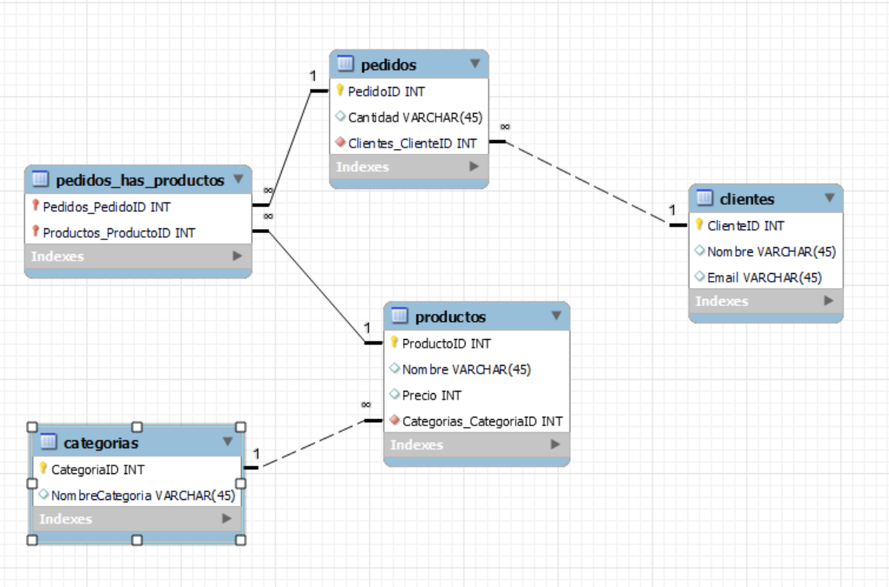

# REPASO MySQL


## Creación de la base de datos

Vamos a simular que tenemos un negocio de venta online. Partimos de la siguiente información en forma de tablas:
<br>


**Tabla "Productos"**
| ProductoID | Nombre         | Precio | CategoriaID |
|------------|----------------|--------|-------------|
| 1          | Portátil       | 1000   | 1           |
| 2          | Smartphone     | 600    | 1           |
| 3          | Televisor      | 800    | 2           |
| 4          | Impresora      | 150    | 3           |
| 5          | Tablet         | 400    | 1           |

<br>

**Tabla "Categorías":**
| CategoriaID | NombreCategoria |
|-------------|-----------------|
| 1           | Electrónica     |
| 2           | Electrodomésticos |
| 3           | Oficina         |

<br>

**Tabla "Clientes"**
| ClienteID | Nombre | Email                |
|-----------|--------|----------------------|
| 101       | Ana    | ana@example.com      |
| 102       | Carlos | carlos@example.com   |
| 103       | Maria  | maria@example.com    |
| 104       | Luis   | luis@example.com     |
| 105       | Sofía  | sofia@example.com    |
| 106       | Juan   | juan@example.com     |
| 107       | Laura  | laura@example.com    |
| 108       | Pedro  | pedro@example.com    |

<br>

**Tabla "Pedidos"**
| PedidoID | ClienteID | ProductoID | Cantidad |
|----------|-----------|------------|----------|
| 1        | 101       | 1          | 2        |
| 2        | 102       | 2          | 1        |
| 3        | 103       | 3          | 1        |
| 4        | 104       | 4          | 3        |
| 5        | 105       | 5          | 2        |
| 6        | 106       | 1          | 1        |
| 7        | 101       | 4         | 2        |
| 8        | 108       | 3          | 2        |

<br>

### Métodos de creación

<details>
<summary>EERD + Forward Engineer(haz clic para expandir)</summary>

<br>




</details>

<details>
<summary>Código SQL (haz clic para expandir)</summary>

<br>

CREATE DATABASE repasosql;
USE repasosql;


CREATE TABLE Categorias (
    CategoriaID INT PRIMARY KEY,
    NombreCategoria VARCHAR(255)
);


CREATE TABLE Productos (
    ProductoID INT PRIMARY KEY,
    Nombre VARCHAR(255),
    Precio DECIMAL(10, 2),
    CategoriaID INT,
    FOREIGN KEY (Categorias_CategoriaID) REFERENCES Categorias(CategoriaID)
);


CREATE TABLE Clientes (
    ClienteID INT PRIMARY KEY,
    Nombre VARCHAR(255),
    Email VARCHAR(255)
);


CREATE TABLE Pedidos (
    PedidoID INT PRIMARY KEY,
    Clientes_ClienteID INT,
    FOREIGN KEY (Clientes_ClienteID) REFERENCES Clientes(ClienteID)
);


CREATE TABLE Pedidos_has_Productos (
    Pedidos_PedidoID INT,
    Productos_ProductoID INT,
    Cantidad INT,
    FOREIGN KEY (Pedidos_PedidoID) REFERENCES Pedidos(PedidoID),
    FOREIGN KEY (Productos_ProductoID INT,
) REFERENCES Productos(ProductoID)
);

</details>

### Relaciones entre entidades

1. One-to-Many entre "Clientes" y "Pedidos":

- Clave Primaria (PK) en la tabla "Clientes": ClienteID
- Clave Foránea (FK) en la tabla "Pedidos": ClienteID
- Relación: Un cliente puede realizar varios pedidos, pero un pedido está asociado a un único cliente.

<br>

2. One-to-Many entre "Categorías" y "Productos":

- Clave Primaria (PK) en la tabla "Categorías": CategoriaID
- Clave Foránea (FK) en la tabla "Productos": CategoriaID
- Relación: Una categoría puede tener varios productos, pero un producto pertenece a una única categoría.

<br>

3. Many-to-Many entre "Productos" y "Pedidos" a través de una tabla intermedia "Pedidos_has_Productos" (Many-to-Many):

- Clave Primaria (PK) en la tabla "Productos": ProductoID
- Clave Primaria (PK) en la tabla "Pedidos": PedidoID
- Clave Foránea (FK) en la tabla intermedia "Pedidos_has_Productos" que se relaciona con la tabla "Productos": Productos_ProductoID
- Clave Foránea (FK) en la tabla intermedia "Pedidos_has_Productos" que se relaciona con la tabla "Pedidos": Pedidos_PedidoID
- Relación: Un pedido puede contener varios productos, y un producto puede estar en varios pedidos.

### Trabjando el EERD en Workbench

En el contexto del diseño de bases de datos, las líneas que conectan las tablas representan las relaciones entre ellas. Estas líneas pueden ser continuas o discontinuas (punteadas). La diferencia entre ambas radica en la forma en que se establecen las restricciones de clave foránea y cómo se interpretan en el modelo de datos.

Línea Continua: En una línea continua, las restricciones de clave foránea están definidas como "obligatorias". Esto significa que, en la relación entre dos tablas, cada registro en la tabla secundaria (la que tiene la clave foránea) debe tener una correspondencia en la tabla principal (la que tiene la clave primaria).

Línea Discontinua (punteada): En una línea discontinua, las restricciones de clave foránea están definidas como "opcionales" o "pueden ser nulas". Esto significa que en la relación entre dos tablas, los registros en la tabla secundaria pueden no tener una correspondencia en la tabla principal, lo que se traduce en que la clave foránea puede tener valores nulos en algunos registros.


## Consultas en MySQL

### Breve recordatorio sobre JOINS

En SQL, los "JOINS" son una forma de combinar datos de múltiples tablas en una sola consulta. Hay varios tipos de joins, pero los principales son tres: INNER JOIN, LEFT JOIN y RIGHT JOIN.

- INNER JOIN (Unión interna):

Para qué sirve: El INNER JOIN se utiliza para combinar dos tablas y devolver solo los registros que tienen coincidencias en ambas tablas.

Ejemplo: Imagina que tienes una tabla de "Clientes" y otra tabla de "Pedidos." Un INNER JOIN entre estas tablas te mostraría solo los clientes que han realizado pedidos.


- LEFT JOIN:

Para qué sirve: El LEFT JOIN se utiliza para combinar dos tablas y mostrar todos los registros de la tabla izquierda (primera tabla) y los registros coincidentes de la tabla derecha (segunda tabla).

Ejemplo: Si haces un LEFT JOIN entre las tablas "Clientes" y "Pedidos," obtendrás todos los clientes, incluso aquellos que no han realizado pedidos. Los registros de "Clientes" aparecerán en la salida, y si un cliente ha realizado un pedido, se mostrará la información del pedido.


- RIGHT JOIN:

Para qué sirve: El RIGHT JOIN es similar al LEFT JOIN, pero muestra todos los registros de la tabla derecha (segunda tabla) y los registros coincidentes de la tabla izquierda (primera tabla).

Ejemplo: Si haces un RIGHT JOIN entre las tablas "Clientes" y "Pedidos," obtendrás todos los pedidos, incluso aquellos que no tienen un cliente asociado. Los registros de "Pedidos" aparecerán en la salida, y si hay un cliente asociado, se mostrará la información del cliente.

<br>

### Queries

**1. Obtener todos los productos de una categoría específica, en este caso "Electrónica", con su precio.**

```sql
SELECT p.Nombre, p.Precio, c.NombreCategoria
FROM Productos p
JOIN Categorias c ON p.Categorias_CategoriaID = c.CategoriaID
WHERE c.NombreCategoria = 'Electrónica';
```

**Explicación:**
- Utilizamos una consulta SELECT para seleccionar los nombres y precios de los productos junto con el nombre de la categoría.
- Usamos la cláusula JOIN para combinar la tabla "Productos" con la tabla "Categorías" según la clave "CategoriaID".
- Filtramos los resultados utilizando la cláusula WHERE para obtener solo los productos de la categoría "Electrónica".

**2. Calcular el total de ventas de cada producto por categoría.**

```sql
SELECT c.NombreCategoria, p.Nombre, SUM(pe.Cantidad) AS TotalVentas
FROM Categorias c
JOIN Productos p 
ON c.CategoriaID = p.Categorias_CategoriaID
JOIN pedidos_has_productos php 
ON p.ProductoID = php.Productos_ProductoID
JOIN pedidos pe
ON php.Pedidos_PedidoID=pe.PedidoID
GROUP BY c.NombreCategoria, p.Nombre;
```

**Explicación:**
- Utilizamos una consulta SELECT para seleccionar el nombre de la categoría, el nombre del producto y la suma de la cantidad vendida.
- Usamos la cláusula JOIN para combinar las tablas "Categorías", "Pedidos" y "Productos".
- Utilizamos GROUP BY para agrupar los resultados por categoría y nombre del producto.

**3. Encontrar los productos más vendidos por cliente.**

```sql
SELECT c.Nombre, p.Nombre AS Producto, MAX(pe.Cantidad) AS MaxCantidad
FROM Clientes c
JOIN Pedidos pe 
ON c.ClienteID = pe.Clientes_ClienteID
JOIN pedidos_has_productos php
ON pe.PedidoID = php.Pedidos_PedidoID
JOIN Productos p 
ON php.Productos_ProductoID = p.ProductoID
GROUP BY c.Nombre, p.Nombre
ORDER BY MaxCantidad 
DESC;
```

**Explicación:**
- Utilizamos una consulta SELECT para seleccionar el nombre del cliente, el nombre del producto y la máxima cantidad comprada por producto.
- Combinamos las tablas "Clientes," "Pedidos," "pedidos_has_productos " y "Productos" mediante JOIN.
- Utilizamos GROUP BY para agrupar los resultados por cliente y producto.

**4. Encontrar el cliente que más gastó.**

```sql
SELECT c.Nombre, SUM(pe.Cantidad * p.Precio) AS total_gastado
FROM Clientes c
LEFT JOIN Pedidos pe
ON c.ClienteID = pe.Clientes_ClienteID
LEFT JOIN Pedidos_has_Productos php 
ON pe.PedidoID = php.Pedidos_PedidoID
LEFT JOIN Productos p
ON php.Productos_ProductoID = p.ProductoID
GROUP BY pe.Clientes_ClienteID, c.Nombre
ORDER BY total_gastado
DESC;
```

**Explicación:**
- Utilizamos una consulta SELECT para seleccionar el nombre del cliente y el monto máximo de su pedido.
- Combinamos las tablas "Clientes" y "Pedidos" mediante LEFT JOIN.
- Utilizamos GROUP BY para agrupar los resultados por cliente.
- Usamos la función de agregación SUM para encontrar al cliente que más gastó.

